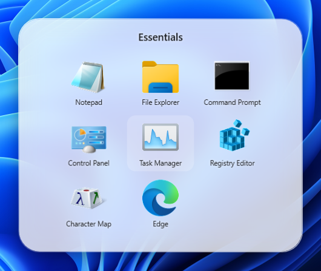
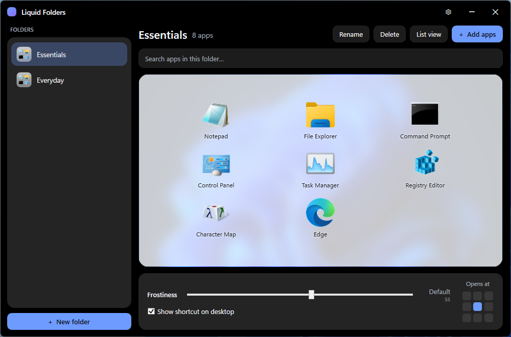

# Liquid Folders

**iOS/Android-style app folders for the Windows desktop.** Group your desktop shortcuts into
beautiful frosted-glass folders that open into a paged grid — just like a phone home screen.

<p align="center">
  
</p>

A closed folder sits on your desktop as a normal icon showing the apps inside. Single-click it
and it expands into a floating **liquid-glass** panel; click any app to launch it.

<p align="center">
  
</p>

## Features

- **Frosted glass folders** — closed folders show a live composite of the real app icons inside;
  open folders are a genuine blurred-glass panel with adjustable **frostiness**.
- **Single-click to open** — only *your* folders; the rest of the desktop keeps its normal
  double-click behavior.
- **Paged 3×3 grids** — folders hold as many apps as you like, with page dots and arrows.
- **Drag & drop** — drop apps/shortcuts onto the open folder to add them; drag to rearrange;
  right-click or press **Delete** to remove.
- **Modern manager** — a chromeless, theme-adaptive (light/dark) glass window to create, rename,
  delete and organize folders. The main view *is* the folder — rearrange it live.
- **Per-folder settings** — frostiness (with a default detent at 55) and a 3×3 **“Opens at”**
  picker to choose where on the screen the panel appears.
- **Import / Export** — back up your folders to a file and import them on another PC; each app
  that’s installed there is **re-linked automatically**, in the same order.
- **In-app updates** — checks GitHub Releases for a newer version.

## Install

1. Download **`LiquidFolders.exe`** from the [latest Release](../../releases/latest).
2. Run it. It’s a single self-contained file — **no .NET install required** on Windows 10/11 (x64).
3. Open the manager (the **Liquid Folders** desktop shortcut, or the tray icon) and create a folder.

> Tip: put the `.exe` somewhere permanent (e.g. a folder in your user directory) before creating
> folders, so your desktop folder icons keep pointing at it.

## Build from source

Requires the [.NET 10 SDK](https://dotnet.microsoft.com/download).

```bash
# Run
dotnet run --project src/GlassFolders.csproj

# Publish a single self-contained exe
dotnet publish src/GlassFolders.csproj -c Release -r win-x64 --self-contained true ^
  -p:PublishSingleFile=true -p:IncludeNativeLibrariesForSelfExtract=true ^
  -p:EnableCompressionInSingleFile=true -o dist
```

## How it works

- Each folder is a real directory of `.lnk` shortcuts under `%LOCALAPPDATA%\GlassFolders`.
- The **closed** desktop icon is a `.lnk` whose icon is a dynamically generated multi-resolution
  `.ico` compositing the current first-page app icons onto a frosted panel.
- Clicking it opens the app (via `--open <folder>`) instead of launching a program; the expanded
  panel is a WPF glass window that renders each app’s real icon.

## Updates

The **Check for updates** button (Settings ⚙) compares your version against the latest
[GitHub Release](../../releases). Publish a new release with a tag like `v1.2.3` and the app will
offer the download. (For this to work the release must be publicly reachable — i.e. a public repo,
or public releases.)

## Tech

C# · WPF · .NET 10 (Windows). No external UI dependencies.
